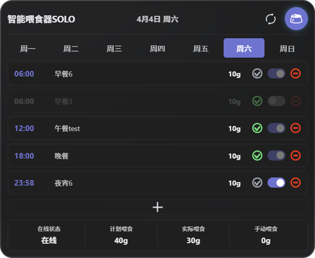

# PetKit Feeder Lovelace Card

[](https://github.com/hacs/integration)

English | [简体中文](README.md)

A Home Assistant Lovelace card designed for PetKit smart feeders.

> ⚠️ **Important**: This card requires the [PetKit Feeder Integration](https://github.com/ningjx/petkit-feeder) to be installed first.

## Preview



## Features

- **Feeding Schedule Management** - Visually manage weekly feeding schedules with support for adding, editing, and deleting
- **Feeding History** - Track feeding details, showing planned vs actual amounts
- **Manual Feeding** - One-click food dispensing
- **Status Monitoring** - Real-time device status, WiFi signal, desiccant status
- **Weekly View** - Quick navigation between different days

## Interaction

| Action           | Effect                |
|------------------|-----------------------|
| Click time       | Edit time             |
| Click name       | Edit name             |
| Click amount     | Edit portion size     |
| Click toggle     | Enable/disable plan   |
| Click delete     | Delete plan           |
| Focus out        | Auto save             |
| ESC              | Cancel edit           |
| Click dashed box | Add new plan          |

## Prerequisites

1. Home Assistant (2024.1.0 or higher)
2. [PetKit Feeder Integration](https://github.com/ningjx/petkit-feeder) installed
3. PetKit feeder device configured

## Installation

### HACS (Recommended)

1. HACS → Frontend → Explore and download repositories
2. Search for "Petkit Feeder Card"
3. Click download
4. Add the card to your dashboard

### Manual Installation

1. Download `dist/petkit-feeder-card.js`
2. Copy to your Home Assistant `www` directory
3. Add resource reference in Lovelace configuration:

   ```yaml
   resources:
     - url: /local/petkit-feeder-card.js
       type: module
   ```

## Configuration

```yaml
type: custom:petkit-feeder-card
device_id: "YOUR_DEVICE_ID"
```

> 💡 **Tip**: The `device_id` can be found in the "Device ID" sensor of your PetKit device in Home Assistant.

### Configuration Options

| Parameter        | Type    | Required | Default       | Description                |
|------------------|---------|----------|---------------|----------------------------|
| `device_id`      | string  | Yes*     | -             | Device ID                  |
| `entity`         | string  | No       | Auto-inferred | Feeding plan sensor        |
| `history_entity` | string  | No       | Auto-inferred | History record sensor      |
| `name`           | string  | No       | Device name   | Card title                 |
| `show_timeline`  | bool    | No       | true          | Show timeline              |
| `show_summary`   | bool    | No       | true          | Show statistics            |
| `show_actions`   | bool    | No       | true          | Show action buttons        |

*Either `device_id` or `entity` is required

## Supported Devices

| Device             | Model | Status            |
|--------------------|-------|-------------------|
| Fresh Element Solo | D4    | ✅ Supported      |
| Fresh Element      | D3    | 🚧 Not Supported  |
| Fresh Element Duo  | D4s   | 🚧 Not Supported  |
| Feeder Mini        | Mini  | 🚧 Not Supported  |

## Related Projects

- [PetKit Feeder Integration](https://github.com/ningjx/petkit-feeder) - Backend integration

## Development

```bash
npm install
npm run build
```

## Disclaimer

- This is not an official PetKit product
- API may change without notice

## License

MIT